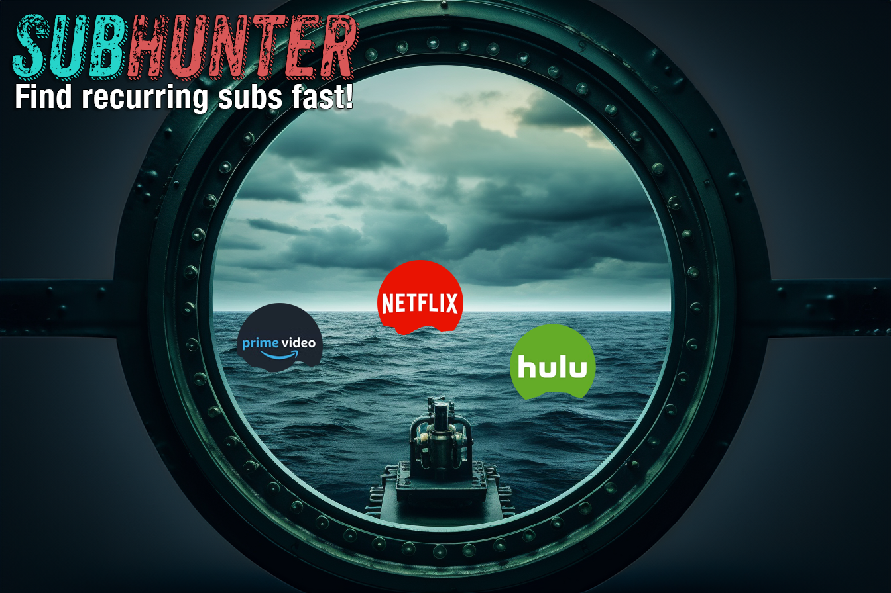

# SubHunter




[](LICENSE)


## Description

SubHunter is a web application that allows users to upload a CSV file and identify duplicate entries in a specific column. The data is presented in a table in a user-friendly dashboard. The dashboard also includes features to highlight and remove table rows.  It is currently used for searching bank account activity for recurring payments that could be subscription services.

## Features

- Upload a CSV file.
- Parse the CSV file and identify duplicate entries in the "Description" column.
- Present the data in a Material-UI table.
- Highlight rows by clicking a checkmark icon.
- Remove rows by clicking an X icon.
- Undo the removal of a row.
- Display a notification for 10 seconds after a row is removed.

## Technologies Used

- Back-end: Go
- Front-end: React, Material-UI
- Testing: Jest, React Testing Library

## Requirements

- Go version 1.17 or later.
- Node.js version 14 or later.
- NPM version 6 or later.

## Installation

### Development

Clone the repository:

```sh
git clone https://github.com/user/repo.git
cd repo
```

Install the Go dependencies:

```sh
go get .
```

Start the Go server:

```sh
go run server/main.go
```

Install the Node.js dependencies:

```sh
cd client
npm install
```

Start the React development server:

```sh
npm start
```

The application will be available at `http://localhost:3000`.

### Production

Build the Go server:

```sh
go build server/main.go
```

Build the React application:

```sh
cd client
npm run build
```

Start the server:

```sh
./main
```

The application will be available at `http://localhost:8080`.

## Testing

Run the Go tests:

```sh
go test ./...
```

Run the React tests:

```sh
cd client
npm test
```

## License

[MIT](LICENSE)